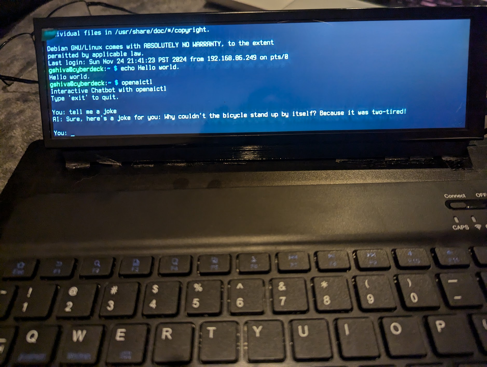
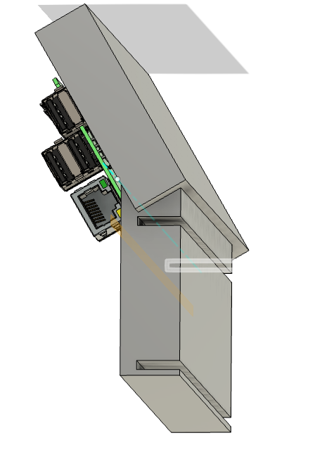

# Cyberdeck Setup Guide

This guide provides step-by-step instructions for configuring your Cyberdeck,
including setting up the LCD display orientation, enabling Bluetooth keyboard
functionality, managing Tmux sessions, and increasing the terminal font size.

---

## Parts Used

* [8.8" LCD Display from Ali Express - US
  $37](https://www.aliexpress.us/item/3256805590955482.html?spm=a2g0o.order_list.order_list_main.5.21ef1802Ir5lVt&gatewayAdapt=glo2usa)
* [Raspberry PI 2 Model B for low power
  consumption](https://www.raspberrypi.com/products/raspberry-pi-2-model-b/)
  (works out to 8 hours with RPI + Screen and whopping 24 hours with no screen)
* [Bluetooth USB Keyboard - US $14](https://a.co/d/6yGGrCh)
* [Frameless Chalkboard - US $1.25](https://www.dollartree.com/jot-frameless-chalk-board-8x11-in/355385)

## Cyberdeck Frame

The Cyberdeck uses frameless chalkboard for the keyboard base and also the battery holder.



Here is the [3D model](cyberdeck-screen-support-v5.f3d) that is used to 3D print the screen holder.

[](./cyberdeck-screen-support-v5.f3d)

## **1. Change the Rotation of the LCD Display Video**

The following instructions are from [this
thread](https://forums.raspberrypi.com/viewtopic.php?t=247619#p1730799). Thanks
RPi Community!

To rotate the LCD display to a horizontal orientation:

1. Open the `cmdline.txt` file located in `/boot/firmware/`:

   ```bash
   sudo nano /boot/firmware/cmdline.txt
   ```

2. Add or update the following parameter:

   ```bash
   video=HDMI-A-1:480x1920@60,rotate=270
   ```

3. Ensure the entire line in the file looks similar to this:

   ```bash
   console=serial0,115200 console=tty1 root=PARTUUID=247a1fd9-02 rootfstype=ext4 fsck.repair=yes rootwait cfg80211.ieee80211_regdom=US video=HDMI-A-1:480x1920@60,rotate=270
   ```

   > **Note:** Replace `PARTUUID` and other parameters with those already
   > present in your file.

4. Save the file and exit.

5. Reboot the system for the changes to take effect:

   ```bash
   sudo reboot
   ```

---

## **2. Set Up the Bluetooth Keyboard**

### Why Use expect Instead of Plain Bash?

The bluetoothctl tool requires interactive commands for setting up and managing
Bluetooth devices. The default-agent command, in particular, does not succeed in
plain bash scripts because it reports "No agent is registered" even when the
command sequence is correct. This happens because bluetoothctl expects a live
session where the agent is explicitly registered (agent on) before setting it as
the default agent.

Using expect allows us to simulate these interactions programmatically, ensuring
that:

1. The agent is successfully registered (agent on).
1. The default-agent command succeeds in setting the registered agent.

This makes it possible to automate Bluetooth keyboard pairing and reconnection
processes reliably.

### Create a Script to Manage Bluetooth Keyboard

1. Create the script file:

   ```bash
   sudo nano /usr/local/bin/enable-default-agent-and-pair.sh
   ```

2. Copy the script from the `scripts/enable-default-agent-and-pair.sh` file
   included in this project.

3. Make the script executable:

   ```bash
   sudo chmod +x /usr/local/bin/enable-default-agent-and-pair.sh
   ```

---

### Automate the Script with Systemd

1. Copy the `keyboard-monitor.service` and `keyboard-monitor.timer` files from
   the `systemd/` directory into `/etc/systemd/system/`:

   ```bash
   sudo cp systemd/keyboard-monitor.* /etc/systemd/system/
   ```

2. Enable and start the timer:

   ```bash
   sudo systemctl daemon-reload
   sudo systemctl enable keyboard-monitor.timer
   sudo systemctl start keyboard-monitor.timer
   ```

---

## **3. Persist Tmux Sessions**

### Why Tmux?

Tmux allows you to split your terminal into panes, manage multiple sessions, and
persist layouts even after a reboot. By combining Tmux with the Resurrect
plugin, you can preserve your layout and workflow seamlessly. This is useful in
a small terminal when you are running one command and want to use the output in
another. For e.g. since google search is not an easy option in small text only
terminals, I use the [`openaictl`](./openaictl) to find solutions to problems.
With tmux, I can have the [`openaictl`](./openaictl) session on the left pane
and try out the instructions on the right pane.

### Show don't tell

Asciinema video showing how I use tmux and openaictl in case I run into issues
when using terminal only window.

[](https://asciinema.org/a/OYazu5MjPy0aW6n1ezEvBmvLw)

### Install and Configure Tmux

1. Install Tmux:

   ```bash
   sudo apt update && sudo apt install -y tmux
   ```

2. Install Tmux Plugin Manager (TPM):

   ```bash
   git clone https://github.com/tmux-plugins/tpm ~/.tmux/plugins/tpm
   ```

3. Update your [.tmux.conf](./scripts/.tmux.conf) file:

   ```bash
   nano ~/.tmux.conf
   ```

   Add the following:

   ```bash
   # Initialize Tmux Plugin Manager
   run '~/.tmux/plugins/tpm/tpm'

   # Plugins
   set -g @plugin 'tmux-plugins/tmux-resurrect'
   set -g @plugin 'tmux-plugins/tmux-continuum'

   # Enable auto-restore
   set -g @continuum-restore 'on'
   ```

4. Reload Tmux configuration:

   ```bash
   tmux source ~/.tmux.conf
   ```

5. Install plugins: Inside Tmux, press `Ctrl-b I`.

---

### Automate Tmux with Systemd

1. Create the Systemd service [tmux.service](./systemd/tmux.service):

   ```bash
   sudo nano /etc/systemd/system/tmux.service
   ```

   Add the following:

   ```ini
   [Unit]
   Description=Tmux session manager
   After=network.target

   [Service]
   Type=forking
   ExecStart=/usr/bin/tmux new-session -d -s main
   ExecStop=/usr/bin/tmux kill-session -t main
   Restart=always
   User=<your-username>
   WorkingDirectory=/home/<your-username>

   [Install]
   WantedBy=multi-user.target
   ```

   Replace `<your-username>` with your username.

2. Enable and start the service:

   ```bash
   sudo systemctl daemon-reload
   sudo systemctl enable tmux.service
   sudo systemctl start tmux.service
   ```

---

### Tmux Verification

1. Detach your session using:

   ```bash
   Ctrl-b d
   ```

2. Reboot the system and verify that the Tmux session is restored using:

   ```bash
   tmux attach
   ```

---

## **4. Increase the Terminal Font Size**

To increase the font size in the terminal:

### For Console (TTY, Non-Graphical Terminal)

1. Run the following command:

   ```bash
   sudo dpkg-reconfigure console-setup
   ```

2. Follow the prompts:
   * Select UTF-8 as the character set.
   * Choose Terminus as the font.
   * Select 16x32 as the font size.
3. Reboot to apply changes.

---

## System Verification

* Reboot the system and verify that the LCD is oriented correctly.
* Turn the Bluetooth keyboard off and on to confirm it reconnects automatically.
* Check the terminal font size to ensure readability.
* Verify that tmux sessions persist.
